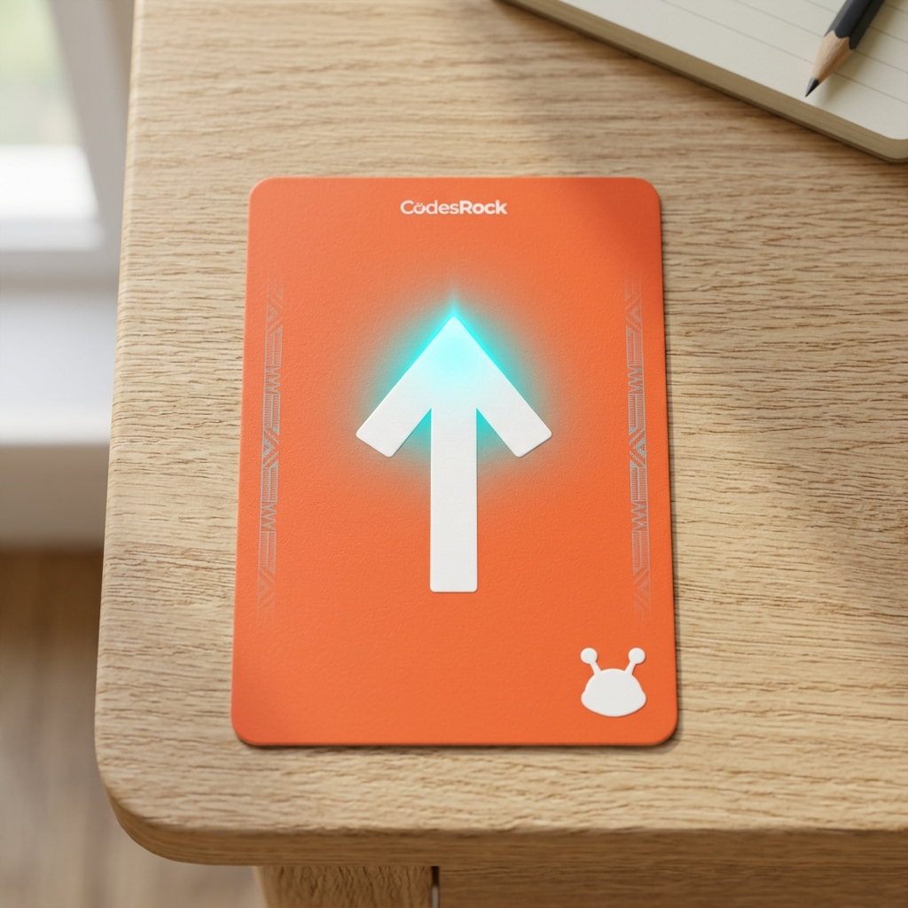
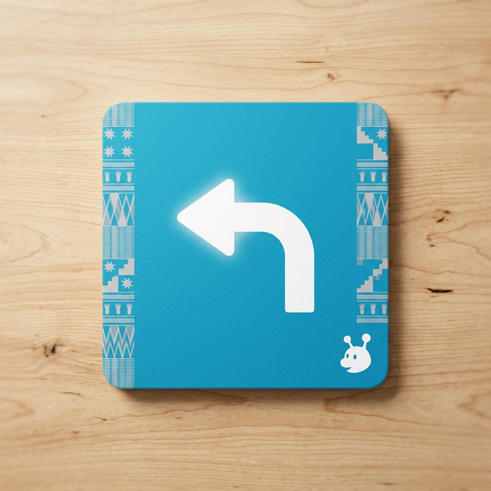
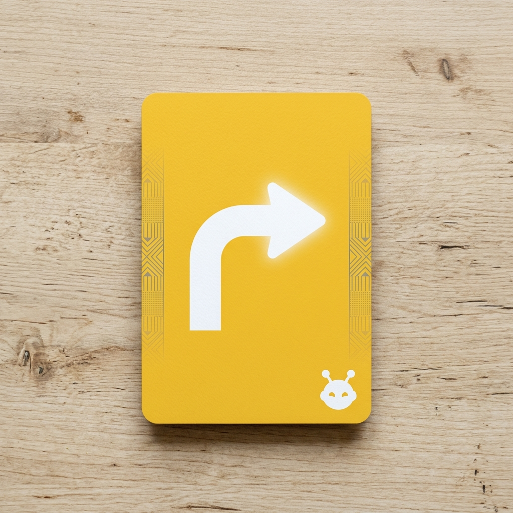
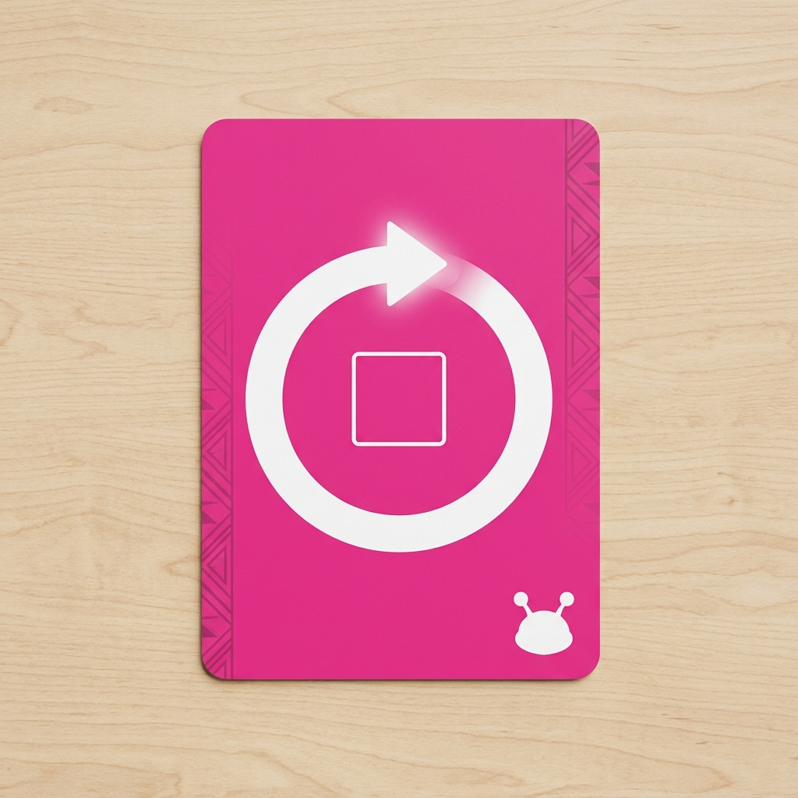
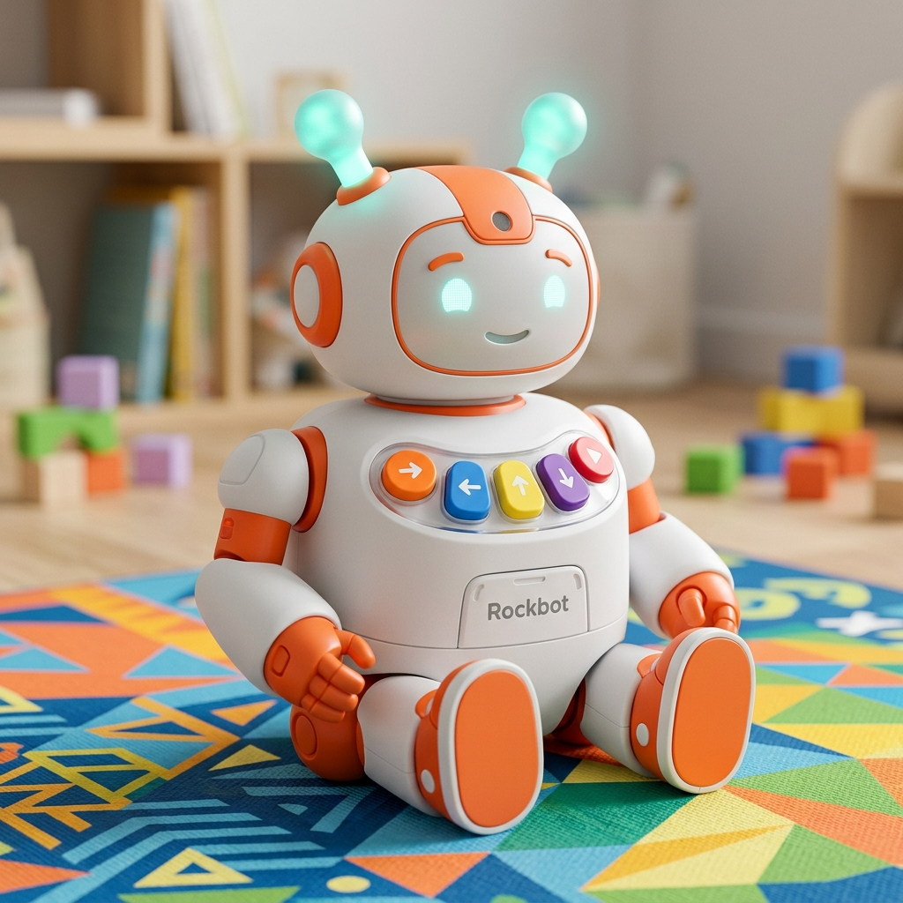

# CodesRock: Logic Card UI Kit (Physical Prototype v3)

This is a portable version of the UI Kit. The images are stored in the `prototypes/` folder.

````carousel

<!-- slide -->

<!-- slide -->

<!-- slide -->

````

## Color-Coding Strategy
*   **Forward (Orange #FF7340):** Primary movement action.
*   **Turn Left (Blue #46C5D5):** Cool-toned directional shift.
*   **Turn Right (Yellow #FDC82F):** Bright-toned directional shift.
*   **Loop (Pink #EC4899):** Distinct logic flow command.

## Rockbot Physical Interface


## UI/UX Benefits for Children
1.  **Instant Recognition:** Children can identify a command by color before they even read the icon or text.
2.  **Hardware Alignment:** The Rockbot's physical buttons will mirror these colors, creating a seamless mental bridge between the cards and the robot's hardware.
3.  **Visual Syntax:** Building a sequence of cards creates a "color-coded program" that is easy to debug visually.
