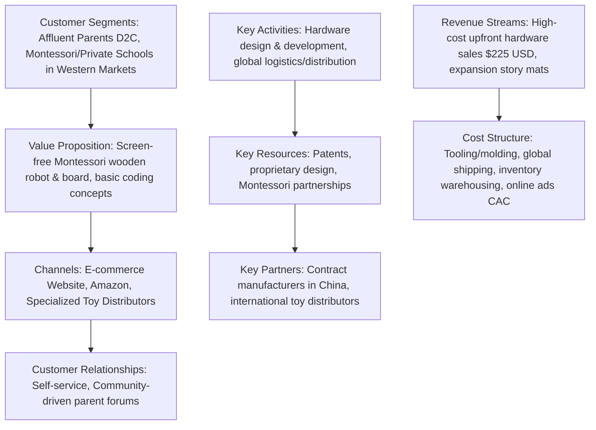

# UNICEF StartUp Lab 6 – Business Module: Day 1 Homework & Day 2 Preparation
**Venture:** CodesRock Labs Ltd
**Date:** June 2, 2026 (Work Week 3)

---

## 📋 Part 1: Day 1 Homework Submission

### Task 1: Customer Interviews (3 Conversations)
To validate our customer assumptions and refine our Business Model Canvas (BMC), we conducted three customer interviews targeting our primary customer segments (Parents & School Heads).

| Customer Profile | Current Alternatives | Biggest Pain Point | Willingness to Pay |
| :--- | :--- | :--- | :--- |
| **Customer 1: Akosua** *(Parent of a 4-year-old, East Legon, Accra)* | iPad (YouTube Kids, spelling apps), Lego blocks. | **Screen Time Addiction:** Worried about eye strain, lack of physical movement, and "zombie-like" isolation, yet wants her child to learn logical thinking early. | **₵2,000 – ₵2,500** upfront for a high-quality physical coding toy that keeps the child engaged offline. |
| **Customer 2: Kwabena** *(Parent of a 5-year-old, Tema)* | Scratch Junior on a shared laptop, physical puzzles. | **Abstract Concepts & Supervision:** Finds screen-based coding too abstract for a 5-year-old. Requires constant supervision to make sure the child isn't clicking away. | **₵1,800 – ₵2,200** for an independent, tactile learning tool his daughter can explore safely on the floor. |
| **Customer 3: Sister Beatrice** *(Principal of a Private School, Kumasi)* | Standard paper ICT textbooks; skipping early-years STEM entirely. | **High Lab Setup Costs & Teacher Skill Gap:** Setting up a computer lab is too expensive. Furthermore, early-years teachers lack IT training to teach coding. | **₵5,850 standard onboarding fee** (covers initial kits, teacher portal access and support for 1 term. Subsequent terms billed at ₵50/teacher and ₵5/student monthly, transferred to parents via activity fees). |

*Key Takeaway:* While schools handle the upfront onboarding, the cost is **indirectly transferred to the parents** (e.g., via termly fees). Therefore, the parent is the ultimate customer in this B2B2C model, and marketing must satisfy both parental development needs (screen-free coding) and school operational needs.

---

### Task 2: Competitor BMC Mapping
Our strongest global competitor is **Cubetto** (by Primo Toys), a screen-free wooden coding toy. 

#### Detailed Competitor BMC Analysis

*   **Customer Segments:** Affluent parents globally; Montessori and premium private preschools in Western markets.
*   **Value Propositions:** Screen-free, Montessori-aligned tactile robot kit that teaches basic sequencing and loop commands to children aged 3–6.
*   **Channels:** Direct-to-Consumer (D2C) e-commerce, Amazon, and international educational product distributors.
*   **Customer Relationships:** Self-service digital buying experience; online customer support; teacher/parent resource communities.
*   **Revenue Streams:** Premium upfront hardware playset sales ($225 USD / ~₵3,300 GHS) and expansion packs (additional theme mats and storybooks).
*   **Key Activities:** Industrial design, curriculum framework development, international shipping and fulfillment, online advertising.
*   **Key Resources:** Patent-protected interface, brand equity, custom hardware molds, and educational certifications.
*   **Key Partners:** Chinese manufacturing partners, global shipping lines, and preschool networks.
*   **Cost Structure:** Heavy initial tooling/manufacturing setup, inventory storage fees, shipping/import duties, and paid social media ads (high CAC).

> [!IMPORTANT]
> **CodesRock’s Strategic Moat vs. Cubetto:**
> 1. **Price Accessibility:** Cubetto is priced out of the West African market due to shipping and import duties. CodesRock aims for local manufacturing optimization.
> 2. **Cultural Relevance:** Cubetto uses Western-centric themes. CodesRock integrates localized storytelling, Ghanaian songs, and Kente geometric border patterns.
> 3. **Teacher Portal:** Cubetto provides a toy but no online infrastructure for teachers. CodesRock’s [Teacher Portal](file:///Users/triumphtetteh/Documents/CodeRock_web/codesrock-react/marketing/applications/02_demo_and_qa_prep.md) solves the teacher training bottleneck in local classrooms.

---

### Task 3: Refined Value Proposition Statement
Using the Day 1 template (*"We help [Customer Segment] who want [Goal] to [Outcome] by [How]"*), we have refined our Value Proposition for both customer segments:

#### 1. B2C Segment (Parents)
> **"We help** busy, tech-conscious parents **who want** their young children to develop essential 21st-century problem-solving skills **to** build early computational thinking confidence without the developmental risks of screen time **by** providing a tactile, screen-free coding ecosystem featuring the Rockbot, physical Logic Cards, and localized cultural storytelling.**"**

#### 2. B2B Segment (Schools)
> **"We help** private and public preschool administrators **who want** to implement premium, competitive STEM curriculums **to** attract more enrollments and bypass the high costs of computer labs **by** delivering a turnkey classroom package with physical robots, structured lesson plans, and an intuitive Teacher tracking portal.**"**

---

## 🚀 Part 2: Day 2 Session Preparation (Business Model Types)

Today's session focuses on **choosing the right business model mix** and identifying **riskiest assumptions**. Below is our strategic positioning for today's exercises.

### 1. Primary Business Model Type Selection
We operate a **B2B2C (Business-to-Business-to-Consumer) / Hardware-Enabled Program** business model.

*   **B2B Channel (Schools):** We operate a tiered model:
  - **Private Schools:** Standard onboarding cost of **₵5,850** (covers initial kit, free 1-term Portal access and training). Starting in Term 2, Portal and support is billed at **₵50/month per teacher and ₵5/month per student** (billed termly).
  - **Government / Public Schools:** Subsidized onboarding cost of **₵3,600** (sponsored by CSR partners/NGOs), with recurring materials at a subsidized **₵50 per student** and fully sponsored/free Portal access.
*   **Scaling inside Schools:** Standard onboarding covers a base deployment. The larger the school, the more robots and activity books they purchase to scale the program to all KG and early-grade students.
*   **Ultimate Consumer (Parents):** While schools pay the onboarding cost, the expense is **indirectly transferred to the parents** (e.g., through tuition, activity, or ICT fees). Thus, the parent remains the ultimate customer who must see the educational value (cognitive development, screen-free engagement).
*   **B2C Retail Channel (Parents):** Direct purchase of Home Starter Kits (₵2,430) for home use.

#### Three Justifications:
1. **Leverages School Trust Moat:** Parents trust school-recommended curricula. Selling to the school allows us to reach 100+ children at once while the school acts as the validator.
2. **Indirect Parent Payment Model:** Charging the school ₵5,850 upfront and letting them distribute it across student termly fees (e.g., ₵50 per student) makes the cost highly accessible to parents compared to a ₵2,430 upfront B2C cost.
3. **Low-Barrier Teacher Portal & Support:** Offering the first term free for private schools allows them to establish classroom value before subscription billing (₵50/teacher + ₵5/student monthly) begins, while government schools are fully sponsored, removing financial barriers.

---

### 2. Our Riskiest Model Assumption
> **Riskiest Assumption:** "School heads are willing to serve as a payment channel and transfer the ₵5,850 onboarding and material costs indirectly to parents via student termly fees."
*If this assumption is wrong, schools will reject the program due to capital constraints, forcing us to pivot to direct B2C marketing to parents or seeking NGO/corporate sponsor subsidies for school kits.*

---

### 3. Minimum Viable Test Plan (Next 7 Days)
We will validate this B2B2C billing/transfer mechanism with a **Letter of Intent (LOI)** test.

*   **Target:** Pitch 5 private school heads in Accra who have not yet purchased our kits.
*   **Test:** Present our curriculum and the Teacher Portal (featuring 1 term of free access and support, followed by GHS 50/teacher + GHS 5/student monthly subscription). Pitch the standard ₵5,850 private onboarding model or the ₵3,600 government sponsored model, and propose the billing mechanism. Ask them to sign a non-binding **Letter of Intent (LOI)** to onboard.
*   **Success Criterion:** If **3 out of 5 school heads** sign the LOI and confirm they are willing to transfer the cost to parents via termly fees, we validate that the B2B2C financial channel is viable.
