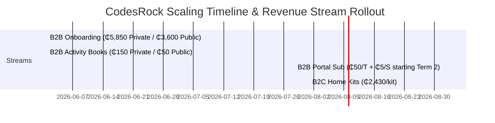
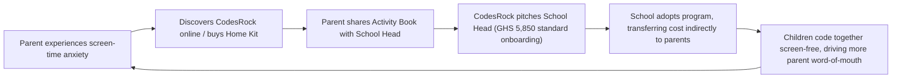

# UNICEF StartUp Lab 6 – Business Module: Complete Workbook
**Venture:** CodesRock Labs Ltd
**Module 3:** Business Modeling, Revenue Models, Resilience, Brand & Pitching
**Date:** June 1 – June 5, 2026

---

## 📅 Day 1: Business Modeling & Diagnostics (June 1)

### 1. The CodesRock Business Model Canvas (BMC)
This canvas maps our operational and commercial engine, structured around our unique B2B2C school deployment model.

```
+---------------------------------------------------------------------------------------------------+
| KEY PARTNERS          | KEY ACTIVITIES        | VALUE PROPOSITIONS    | CUSTOMER RELATIONS   | SEGMENTS          |
|                       |                       |                       |                      |                   |
| 1. Local Printing     | 1. Curriculum Design  | **For Schools:**      | 1. Dedicated School  | **1. Primary B2B  |
|    Partners (Books/   | 2. Hardware Assembly  | Cost-effective,      |    Support Managers  |    Target:**      |
|    Cards)             | 3. Teacher Training   | "lab-less" STEM pro-  | 2. Parent-Teacher    |    Private &      |
| 2. UNICEF Ghana &     | 4. B2B Sales & Outreach| gram; no specialist  |    WhatsApp Groups  |    Public         |
|    KOICA (Credibility)|                       | IT teachers required. |    ("Logic Squad")   |    Preschools.    |
| 3. MEST Africa        |                       |                       |                      |                   |
|    (Network/Scale)    | KEY RESOURCES         | **For Parents:**      |                      | **2. B2C Retail   |
| 4. Ghana Education    |                       | Screen-free, tactile  |                      |    Segment:**    |
|    Service (GES)      | 1. Proprietary Hardware| computational think-  | CHANNELS             |    Tech-conscious |
| 5. Corporate CSR      |    & Cards (Rockbot)  | ing to future-proof   |                      |    parents in     |
|    Sponsors           | 2. Ghanaian-themed    | children safely.     | 1. Parent Advocates  |    Accra/Kumasi.  |
|                       |    Curriculum (Songs) |                       |    (Word-of-Mouth)   |                   |
|                       | 3. Teacher Portal     |                       | 2. B2B Outbound Sales|                   |
|                       |    (app.codesrock.com)|                       | 3. Digital Marketing |                   |
+-----------------------------------------------+-----------------------+----------------------+-------------------|
| COST STRUCTURE                                | REVENUE STREAMS                                                  |
|                                               |                                                                  |
| 1. Robot Component Sourcing & Local Assembly  | 1. B2B Private Onboarding: ₵5,850 onboarding fee (covers kit,    |
| 2. Local Printing (Activity Books & Cards)    |    free 1-term Portal access & support).                         |
| 3. Teacher Portal Hosting & Maintenance       | 2. B2B Private Subscription: ₵50/mo per teacher + ₵5/mo per      |
| 4. Sales Travel & Teacher Training Workshops  |    student starting Term 2 (averaging ₵600/mo).                  |
|                                               | 3. B2B Materials: ₵150/student Activity Book annually (private); |
|                                               |    ₵50 subsidized/sponsored per student (government/public).     |
|                                               | 4. B2B Government Model (Sponsored): ₵3,600 sponsored onboarding  |
|                                               |    fee (funded by CSR/NGOs), with sponsored Portal access.        |
|                                               | 5. B2C Retail Kit Sales: ₵2,430 upfront per Home Kit.            |
+---------------------------------------------------------------------------------------------------+
```

### 2. Venture Health & Diagnostics
We measure the health of CodesRock using five data-driven parameters:

*   **CAC (Customer Acquisition Cost):** Est. **₵1,200 per school** (covers sales team travel, marketing brochures, demonstration kits, and initial teacher workshop costs).
*   **LTV (Lifetime Value):** Est. **₵65,250 per private school** over 3 years.
    *   *Calculation:* ₵5,850 onboarding fee + 3 years of student activity book sales (average school has 100 students, buying books at ₵150/each annually = ₵15,000/year $\times$ 3 years = ₵45,000) + Portal & Support subscription from Term 2 onwards (8 terms $\times$ ₵1,800/term = ₵14,400) + additional hardware sales (₵0 in base model).
    *   *LTV:CAC Ratio:* **54.4x** (highly sustainable B2B2C unit economics).
*   **MRR/ARR (Heartbeat):** Driven by monthly portal subscriptions starting Term 2 (₵50/teacher + ₵5/student) and recurring book purchases (replenished annually at ₵150/book).
*   **Retention / Churn Rate:** Currently **0% churn** across our first **9 partner schools** due to our high-touch teacher support and robust local implementation.
*   **Burn Rate & Runway:** Fixed operational expenses (engineering, local printing, sales) are managed to keep a minimum **18 months of runway** as we scale manufacturing.

---

## 📅 Day 2: Business Model Types & Revenue Forecasting (June 2)

### 1. Selected Business Model: B2B2C / Hardware-Enabled Program
We sell directly to schools using a dual classification system:
*   **Private Schools:** Standard onboarding (₵5,850) and a monthly portal subscription (₵50/teacher + ₵5/student) from Term 2 onwards. The cost is indirectly transferred to the parents via a termly activity/ICT fee (approx. ₵150 per student annually for books + subscription contribution).
*   **Government / Public Schools:** Subsidized onboarding (₵3,600) sponsored by Corporate CSR partners or development agencies (e.g. UNICEF/KOICA). Portal subscription is fully sponsored (0 GHS), and activity books are subsidized to ₵50 per student.

#### Three Justifications:
1. **Leverages School Trust & Distribution Moat:** School heads act as trusted gatekeepers. By pitching directly to schools, we can acquire an entire cohort of 100+ children through a single sales cycle, dramatically reducing customer acquisition friction compared to individual B2C marketing.
2. **Indirect Parent Funding Mechanism:** An upfront hardware cost of GHS 2,430 (our B2C kit) is a significant capital barrier for middle-class Ghanaian households. By charging the school an onboarding fee of GHS 5,850 and allowing them to distribute the costs across student termly fees (e.g., GHS 150/year for books + subscription contribution), the parent pays a highly accessible, low termly fee.
3. **Value-Driven Software Lock-In:** Offering the first term free to private schools establishes classroom integration and shows value before billing begins (GHS 50/teacher + GHS 5/student monthly starting Term 2). Once teachers log student learning outcomes and progress analytics inside the portal, switching costs become high.

#### Riskiest Model Assumption:
> **Riskiest Assumption:** "Private school heads are willing to act as financial intermediaries and indirectly transfer the GHS 5,850 onboarding fee and recurring portal subscription/materials cost to parents via termly fees."
*If this assumption is false, schools will reject our sales proposals due to upfront cash flow constraints, forcing a pivot to direct B2C sales or purely sponsor-funded public deployments.*

#### Minimum Viable Test Plan (7-Day Letter of Intent Test):
To validate this assumption within the next 7 days, we will conduct a Letter of Intent (LOI) campaign:
- **Target:** Pitch 5 private school heads in Accra who are not currently partnered with CodesRock.
- **Pitch:** Present the screen-free coding curriculum, the physical Rockbot kits, and the Teacher Portal. Explain the pricing structure: GHS 5,850 standard onboarding (1st term free portal access and support), and GHS 50/teacher + GHS 5/student monthly starting Term 2, alongside the GHS 150/student annual activity book fee. Propose that these costs be rolled into their termly school activity/ICT fees.
- **Call to Action (The Test):** Request the school head to sign a non-binding **Letter of Intent (LOI)** to onboard for the next academic term under these commercial terms.
- **Success Metric:** If **3 out of 5 school heads** sign the LOI and confirm their willingness to charge parents via termly fees, our B2B2C distribution assumption is validated.

---

### 2. Competitor Revenue Models Analysis
We compare our model to the two major global competitors to define our market advantages.

| Dimension | Cubetto (Primo Toys) | Lego Education | CodesRock Labs |
| :--- | :--- | :--- | :--- |
| **Model Type** | Pure D2C / B2B Hardware Sales | B2B Distributor/Licensing | **B2B2C Hardware-Enabled Program** |
| **Pricing Structure**| High upfront hardware (~₵3,300 GHS) | High upfront lab hardware + software licenses | **Private: ₵5,850 onboarding fee (Portal free for 1st term)<br>Government: ₵3,600 onboarding fee (Sponsored)** |
| **Recurring Fees** | None (one-off purchase) | Annual software/curriculum renewals | **Private: ₵150/student Activity Book annually + Portal subscription (₵50/mo per teacher + ₵5/mo per student)<br>Government: ₵50/student Activity Book (Portal sponsored)** |
| **Teacher Support** | Online community / self-serve manuals | Standard training certification (paid) | **Local support and training (Free for 1 term, then subscription-based for private; fully sponsored for government)** |
| **Local Adaptation**| None (generic global themes) | None (generic STEM concepts) | **Ghanaian localized curriculum (songs, Kente, local context)** |

---

### 3. Customer Validation Log (Customer Conversations)
We conducted customer validation interviews with three key stakeholders to test their willingness to pay under our model.

1. **Sister Beatrice (Principal, Private School, Kumasi):**
   - *What she said:* "We want to offer coding because parents demand it, but setting up a computer lab is too expensive and my teachers don't know how to code. If your kit doesn't require computers and you train my teachers, we are interested. If the onboarding is GHS 5,850, we can easily distribute that among our 120 students in the kindergarten section. That's under GHS 50 per student added to their first-term fees. The GHS 150/year for books is also very reasonable if it replaces the generic ICT textbook we currently buy."
   - *Willingness to Pay:* Highly willing. Confirmed that GHS 5,850 upfront and GHS 150/year for books fits within their existing school fee collection cycles.
2. **Kwabena (Parent of 5-year-old, Tema):**
   - *What he said:* "My daughter uses Scratch Junior on my work laptop, but she gets distracted and I worry about her eyes. I would love a toy that teaches logic offline. GHS 2,430 for a home kit is a bit steep to pay all at once, but if her school offered it as a regular class and charged GHS 100 extra on termly fees, I would pay it without hesitating."
   - *Willingness to Pay:* Moderate for D2C Home Kits; high support for school-based B2B2C billing.
3. **Akosua (Parent of 4-year-old, East Legon, Accra):**
   - *What she said:* "I limit my son's iPad time to 30 minutes a day because he gets irritable. A coding robot that is completely screen-free is perfect. I am willing to spend up to GHS 2,500 upfront for a high-quality kit that he can play with at home. If the school introduces it, I would gladly pay the GHS 150 annual book fee."
   - *Willingness to Pay:* High. Validates both our B2C pricing (GHS 2,430) and our school-based material fee (GHS 150/year).

---

### 4. Revenue Stream Mapping & Forecasting
We have mapped out our revenue streams to project cash flow as we scale from 9 to 50 schools:



*   **Primary Stream:** B2B Material Scaling (₵150 private / ₵50 government Activity Books) and monthly portal subscriptions starting Term 2 (₵50/teacher + ₵5/student).
*   **Forecasting Formula:** 
    $$\text{Annual Revenue} = (\text{New Private} \times \text{₵5,850}) + (\text{New Public} \times \text{₵3,600}) + (\text{Private Students} \times \text{₵150}) + (\text{Govt Students} \times \text{₵50}) + (\text{Portal Subscriptions}) + (\text{B2C Kits} \times \text{₵2,430})$$

---

---

## 📅 Day 3: Child Protection & Business Resilience (June 3)

### 1. Child Protection & Safety Integration
As a UNICEF-supported EdTech company, child protection is embedded in our product design, not treated as an afterthought.

```
              +-------------------------------------------------------+
              |           CodesRock Child Safety Framework            |
              +-------------------------------------------------------+
                                          |
         +--------------------------------+--------------------------------+
         |                                |                                |
         v                                v                                v
+------------------+             +------------------+             +------------------+
|   DATA PRIVACY   |             | PHYSICAL SAFETY  |             | ETHICAL DESIGN   |
| Zero child data  |             | Non-toxic ABS    |             | Gamification is  |
| on Portal; tracked|            | plastic; round   |             | for teachers to  |
| via anonymous id |             | corners; matte   |             | track progress,  |
| numbers/groups.  |             | non-sharp cards. |             | not children.    |
+------------------+             +------------------+             +------------------+
```

*   **Data Protection:** The CodesRock Teacher Portal (`app.codesrock.com`) does not collect any personal identifying information (PII) of children. Students are registered anonymously (e.g., "Student A1," "Group 3") to track progression.
*   **Physical Safety:** 
    *   The **Rockbot** hardware is manufactured using non-toxic, child-safe ABS plastic with round, drop-resistant edges.
    *   **Logic Cards** are printed with a smooth matte finish on heavy, thick cardstock (350gsm) to prevent paper cuts and resist tearing.
*   **Ethical Marketing:** All marketing materials focus on child agency, social cooperation, and physical play. We explicitly advocate against screen addiction.

---

### 2. Customer Unit Economics (Private School)
We estimate our B2B unit economics over a standard 3-year school partnership lifecycle.

| Economic Metric | Value | Calculation / Assumption |
| :--- | :--- | :--- |
| **Customer Acquisition Cost (CAC)** | **GHS 1,200** | Covers sales team travel, marketing brochures, demonstration kits, and initial teacher workshop costs. |
| **Average Revenue Per Unit (ARPU)** | **GHS 1,812.50 / month** | Calculated as the 3-year total contract value divided by 36 months. |
| **Monthly Churn Rate** | **1.0%** | Schools are highly sticky once teachers are trained and student progress is integrated into the portal. |
| **Lifetime Value (LTV)** | **GHS 65,250** | GHS 5,850 (Onboarding) + GHS 45,000 (100 students x GHS 150/book x 3 years) + GHS 14,400 (Subscription: GHS 1,800/term x 8 terms starting Term 2). |
| **LTV:CAC Ratio** | **54.4x** | GHS 65,250 LTV ÷ GHS 1,200 CAC. Far exceeds the investor benchmark of 3.0x. |
| **Payback Period** | **0.0 months (Immediate)** | Upfront onboarding fee (GHS 5,850) and book sales (GHS 15,000) collected in Month 1 far exceed the GHS 1,200 acquisition cost. |

---

### 3. 12-Month Bottom-Up Revenue Forecast
Our bottom-up forecast is built on a monthly sales capacity of onboarding **3 new private schools** and **1 new government school** per month, starting with our **9 existing active private schools** (which are in Term 2 and paying subscriptions from Month 1). We also project **5 B2C Home Kit sales** monthly. All revenues subtract a **2% transaction fee** for MoMo/card billing gateways.

#### Month-by-Month Forecast Table (All figures in GHS)

| Month | Active Subs (Schools) | New Private (Schools) | New Govt (Schools) | Subs Revenue | Private Onboarding | Private Books | Govt Onboarding | Govt Books | B2C Kits | Gross Revenue | Gateway Fee (2%) | Net Revenue |
| :--- | :---: | :---: | :---: | :--- | :--- | :--- | :--- | :--- | :--- | :--- | :--- | :--- |
| **M1** | 9 | 3 | 1 | 5,400 | 17,550 | 45,000 | 3,600 | 7,500 | 12,150 | 91,200 | 1,824 | **89,376** |
| **M2** | 9 | 3 | 1 | 5,400 | 17,550 | 45,000 | 3,600 | 7,500 | 12,150 | 91,200 | 1,824 | **89,376** |
| **M3** | 9 | 3 | 1 | 5,400 | 17,550 | 45,000 | 3,600 | 7,500 | 12,150 | 91,200 | 1,824 | **89,376** |
| **M4** | 12 | 3 | 1 | 7,200 | 17,550 | 45,000 | 3,600 | 7,500 | 12,150 | 93,000 | 1,860 | **91,140** |
| **M5** | 15 | 3 | 1 | 9,000 | 17,550 | 45,000 | 3,600 | 7,500 | 12,150 | 94,800 | 1,896 | **92,904** |
| **M6** | 18 | 3 | 1 | 10,800 | 17,550 | 45,000 | 3,600 | 7,500 | 12,150 | 96,600 | 1,932 | **94,668** |
| **M7** | 21 | 3 | 1 | 12,600 | 17,550 | 45,000 | 3,600 | 7,500 | 12,150 | 98,400 | 1,968 | **96,432** |
| **M8** | 24 | 3 | 1 | 14,400 | 17,550 | 45,000 | 3,600 | 7,500 | 12,150 | 100,200 | 2,004 | **98,196** |
| **M9** | 27 | 3 | 1 | 16,200 | 17,550 | 45,000 | 3,600 | 7,500 | 12,150 | 102,000 | 2,040 | **99,960** |
| **M10** | 30 | 3 | 1 | 18,000 | 17,550 | 45,000 | 3,600 | 7,500 | 12,150 | 103,800 | 2,076 | **101,724** |
| **M11** | 33 | 3 | 1 | 19,800 | 17,550 | 45,000 | 3,600 | 7,500 | 12,150 | 105,600 | 2,112 | **103,488** |
| **M12** | 36 | 3 | 1 | 21,600 | 17,550 | 45,000 | 3,600 | 7,500 | 12,150 | 107,400 | 2,148 | **105,252** |
| **Total**| - | **36** | **12** | **134,400** | **210,600** | **540,000** | **43,200** | **90,000** | **145,800** | **1,164,000** | **23,280** | **1,140,720** |

---

### 4. Business Resilience & Ghana Market Risk Management
Ghana's macroeconomic environment requires strategic pricing and supply-chain flexibility.

*   **Currency Devaluation Risk (Cedi vs. USD):** We import microcontroller components for the Rockbot in bulk using forward contracts to lock in prices. To hedge further, we assemble the electronics and mold the plastic casings locally in Ghana.
*   **Inflation & Printing Costs:** Our recurring books are printed locally. We maintain bulk printing agreements with Accra-based presses to secure fixed-cost volumes for the academic year.
*   **Parent/School Cash Flow Constraints:** For private schools, the termly activity fee structure absorbs the upfront GHS 5,850 cost and recurring material/sub costs. For government schools, upfront capital constraints are eliminated entirely through our Sponsored Public-Private Partnership (PPP) model, and materials are heavily subsidized.
*   **Delayed Subscription Collection Risk (Mitigation):** We integrate automated invoice reminders and grace period lockouts in the Teacher Portal (`app.codesrock.com`). Private schools pay their termly GHS 1,800 subscription upfront at the beginning of the term (alongside tuition fee collections) rather than monthly, preventing intra-term school cash flow dips.

---

## 📅 Day 4: Brand Design, Customer Loop & Team Building (June 4)

### 1. Brand Guidelines & Cultural Trust
Our brand communicates **"Unplugged Logic"** and local pride.

*   **Key Colors:** Orange (Forward), Blue (Left), Yellow (Right), Pink (Loop) — matching the physical buttons on the Rockbot and mirroring our Logic Cards.
*   **Local Trust Factors:** We weave Ghanaian cultural themes, local counting songs, and geometric **Kente borders** into the cards and activity books to ensure the product feels familiar and premium to local children and parents.

---

### 2. Competition Analysis & Market Landscape
We have completed a comprehensive competitor mapping and SWOT analysis to position CodesRock in the Ghanaian early STEM education market.

#### Competitor Map:
- **Direct Competitors:**
  - *Cubetto (Primo Toys, UK):* Premium wooden hardware, priced at $225 USD upfront. Strong global brand, but imported (high duties) and lacks local teacher tracking portal infrastructure.
  - *Lego Education (Denmark):* Highly recognized, Spike series. Exorbitant pricing (GHS 12,000+ setup) and dependency on expensive computer/tablet lab setups.
- **Indirect Competitors:**
  - *Scratch Junior:* Free MIT tablet app. Requires tablet/laptop hardware and constant adult supervision to maintain educational focus.
  - *Online Coding Camps (Accra):* High-touch, screen-based classes, but expensive and limited to high-income urban families.
- **Substitute Competitors:**
  - *Traditional Paper ICT Textbooks:* Cheap and familiar, but entirely theoretical and passive (drawing keyboards on a blackboard).
  - *Doing Nothing:* Many preschools skip early STEM and computer education entirely due to a lack of resources.

#### Porter's Five Forces sector assessment (Ghana early STEM & EdTech):
- **Competitive Rivalry: MODERATE** — Very few direct players focus on preschool screen-free coding; blue ocean compared to crowded older grades.
- **Threat of New Entrants: MEDIUM-HIGH** — App creation is easy, but hardware-enabled physical distribution creates a manufacturing and operational barrier.
- **Buyer Power: HIGH** — Schools and parents are fee-sensitive, but trained teachers and stored student portal progress create high switching costs.
- **Supplier Power: MEDIUM-HIGH** — Global electronics chip import is exposed to currency fluctuations; mitigated by long-term bulk agreements for printed materials.
- **Threat of Substitutes: HIGH** — Inertia of paper textbooks or skipping STEM entirely is our biggest competitor.

#### Comparative SWOT (CodesRock vs. Cubetto):
- **Strengths Asymmetry:** CodesRock has a step-by-step **Teacher Portal** (`app.codesrock.com`) to track student progression and remove the IT skill gap for educators, alongside a localized curriculum. Cubetto has premium wooden hardware but no teacher tracking software or localized Ghanaian themes.
- **Weaknesses Asymmetry:** CodesRock has early-stage physical assembly lines compared to Cubetto's mature international supply chains. We mitigate this by assembling locally in Ghana to keep costs low.

#### Differentiated Positioning Map:
- **Axes:** Screen-Free vs. Screen-Based (Y-Axis) and Local Resource Accessibility vs. High Infrastructure/Import Dependency (X-Axis).
- CodesRock occupies the top-right quadrant: **Tactile & Screen-Free** and **Locally Accessible** (low cost, zero screen infrastructure requirements).

#### Defensive Moat Statement:
> CodesRock’s long-term defensibility rests on a triple-layer moat:
> 1. **High Switching Costs via Teacher Portal Integration:** Once a school's staff is trained and actively tracking student learning outcomes and lesson plans on `app.codesrock.com`, replacing our program requires re-training staff and losing historical development analytics.
> 2. **Proprietary Hardware-Curriculum Synergy:** The physical Rockbot hardware, custom tactile cards, and locally printed activity books are designed in synergy, making the ecosystem difficult to replicate by a pure-software or imported hardware competitor.
> 3. **Institutional Trust & Localized Alignment:** Our Ghanaian-themed curriculum (local counting songs, storytelling, cultural maps) is fully aligned with the Ghana Education Service (GES) early learning standards and validated by strategic partnerships with UNICEF Ghana and MEST Africa.

---

### 3. The Customer Growth Loop
We turn parent screen-time anxiety into organic school acquisition.



### 4. Team Dynamics & Roles
*   **Triumph (CEO & Tech Lead):** Drives product design, local assembly coordination, and software scaling of the Teacher Portal.
*   **Ellen (COO & Education Lead):** Manages curriculum alignment, school onboarding workshops, and impact metrics reporting.
*   **Upcoming Hires:** Local School Success Coordinators to handle training and support, keeping overheads lean.

---

## 📅 Day 5: Pitch Friday — Business Presentation (June 5)

This script has been optimized for the **Business Module (Module 3)** panel, focusing heavily on scale, supply chain, and B2B2C unit economics.

### 🎙️ The 3-Minute Business Pitch Script

#### 1. The Hook (15 seconds)
"In 15 years, the child who can write code will write their own future. But in Ghana today, early-years coding is either entirely non-existent, or it is trapped behind expensive, damaging screens. How do we teach computational logic to a 4-year-old safely and equitably?"

#### 2. The Solution & Product (45 seconds)
"At CodesRock, we have built the solution: a completely screen-free, tactile coding program. Using our physical Rockbot, color-coded Logic Cards, and localized Ghanaian activity books, kids learn loops, sequences, and debugging through active play. 

And we don't just empower the child: we empower the teacher. Our Teacher Portal at `app.codesrock.com` provides step-by-step guides and progress tracking, removing the IT skill gap for early educators."

#### 3. The B2B2C Commercial Model (60 seconds)
"Our commercial engine is built for the African market. For private schools, we charge a standard onboarding fee of **₵5,850**, which includes their first term of Portal access and support. Starting Term 2, we charge a monthly subscription of **₵50 per teacher and ₵5 per student** to support custom progress tracking. 

As the program scales, private schools purchase recurring annual student Activity Books at **₵150 per student**. Best of all, they indirectly transfer these costs to parents—meaning the school acts as our trusted channel, while the parent remains the paying consumer. 

For government schools, where direct parent fees are not viable, we deploy a sponsored Public-Private Partnership model. Here, corporate CSR partners or development agencies sponsor a subsidized onboarding kit at **₵3,600** per school, with recurring books funded at a subsidized rate of **₵50 per student** and fully sponsored portal access.

With a Customer Acquisition Cost of ₵1,200 and a 3-year Lifetime Value of ₵65,250 per private school, we achieve a highly scalable **54x LTV to CAC ratio**."

#### 4. Traction & Scaling Ask (60 seconds)
"To date, we have partnered with **9 leading educational institutions**, impacting over **317 children** and measuring a **+200% improvement in collaborative problem-solving**. 

Through the UNICEF StartUp Lab, we are looking for strategic partnerships and supply-chain capital to scale our bulk manufacturing. This will drive down unit costs, allowing us to roll out to our next **50 partner schools** (including private and sponsored government tiers). 

Join us in making coding tactile, social, and screen-free. Thank you."
